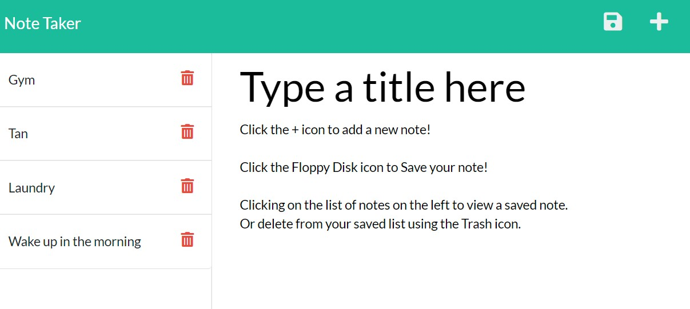

# Note Taker - Homework 10

## Description

This application is a simple note taker. Add, view, and delete saved notes to yourself so you can keep organized!

The objective of this assignment was to path out the backend using Express JS and the Node enviroment to deploy a pre-built frontend.

## Installation

- To see the code repository, visit my [Github](https://github.com/patrickbrown-io/not3taker)

- To install this app, clone the repository and npm i.

## Live Deployment

- To use the app, visit my [Deployment](https://lit-dawn-71064.herokuapp.com/)

## Usage

To create a new app, click the + icon.
Type out your note title and body text of your note.
Press the Save Icon to save your note. It will appear in the left list.

To access a saved note, click the note's title in the left hand side. It will populate the text entry area.

To delete a saved note, click the Trash Can icon to remove the note.

## Walkthrough

Video walkthrough of working application: [YouTube](https://youtu.be/t9Nx2252Ktk)

## Credits

[Patrick Brown](https://github.com/patrickbrown-io)

## Features

## How to Contribute

Send me a message via GitHub and we can connect!
